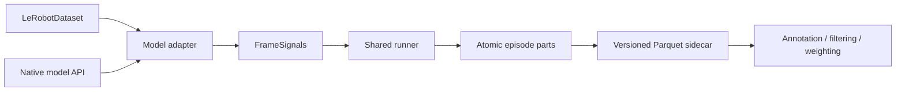

# Offline Reward-Model Scoring

LeRobot's offline scoring workflow runs a reward model over dataset episodes and writes frame-aligned signals to a versioned Parquet sidecar. It does not modify the source dataset or decide which episodes to keep.



The model adapter owns model-specific sampling and preprocessing. The shared runner owns episode bounds, validation, resume, atomic writes, and deterministic merging.

## Score a Dataset

The shared command supports ROBOMETER and RynnValue. For ROBOMETER:

```bash
uv run lerobot-score-dataset \
    --dataset_repo_id=lerobot/libero_10_image \
    --reward_model_path=lerobot/Robometer-4B \
    --device=cuda
```

By default, the artifact is written to `reward_signals/robometer.parquet` under the local dataset root. Use `--output_path=/path/signals.parquet` to choose another location and `--episodes='[0,1]'` to select episodes.

For RynnValue:

```bash
uv run lerobot-score-dataset \
    --dataset_repo_id=lerobot/example-dataset \
    --reward_model_path=/path/to/converted-rynnvalue \
    --device=cuda \
    --inference_fps=1 \
    --max_frames=8 \
    --robot_description="a single-arm robot" \
    --camera_description="a fixed third-person camera"
```

Its default output is `reward_signals/rynnvalue.parquet`. Pass `--horizon_s=SECONDS` only when a task-level horizon is known and bounded progress is needed. Raw remaining time and potential are always retained.

Pass `--push_to_hub=true` to upload the completed artifact to `reward_signals/<model-type>.parquet` in the dataset repository. Atomic episode parts remain local and are not published.

For an immutable run, pass commit hashes through `--dataset_revision` and `--reward_model_revision`. The requested/resolved revisions are stored in artifact provenance and must match when resuming.

The command is resumable by default. Every completed episode is first committed atomically under a hidden `.parquet.parts` directory. A retry skips those episodes only when the dataset revision, model revision, adapter options, episode selection, and schema are unchanged.

## Python API

```python
from pathlib import Path

from lerobot.rewards.scoring import (
    get_signal_descriptors,
    read_frame_signals,
    score_dataset_with_reward_model,
)

summary = score_dataset_with_reward_model(
    dataset,
    reward_model,
    output_path=Path("reward_signals/robometer.parquet"),
    model_id="lerobot/Robometer-4B",
)

table = read_frame_signals(summary.artifact_path)
descriptors = get_signal_descriptors(table)
```

For custom adapters, use `score_dataset(dataset, scorer, ...)`. The scorer returns one `FrameSignals` object per episode. Frame indices may be dense or sparse, but must be episode-local, unique, strictly increasing, and aligned with one-dimensional numeric signal arrays.

## Artifact Contract

Every new artifact contains:

- `index`, `episode_index`, and `frame_index` identity columns;
- namespaced signal columns such as `reward.robometer.progress`;
- semantic descriptors, including bounds, units, direction, comparison scope, and missing-value policy;
- provenance for the dataset, model, adapter options, schema, and LeRobot version.

`bounds` describes the signal's semantic range. Values observed in one run are reported separately in `ScoringSummary`.

The reader also recognizes older LeRobot `progress_sparse` and `progress_dense` Parquet sidecars. It preserves their column names and attaches explicit legacy provenance rather than pretending they were produced by the new schema.

## Scope

Offline scoring is for annotation, inspection, filtering, and later relabeling. It is not used inside the environment control loop. Online RL will use a separate transition-time adapter over the same native model APIs, without Parquet IO or artifact merging.
